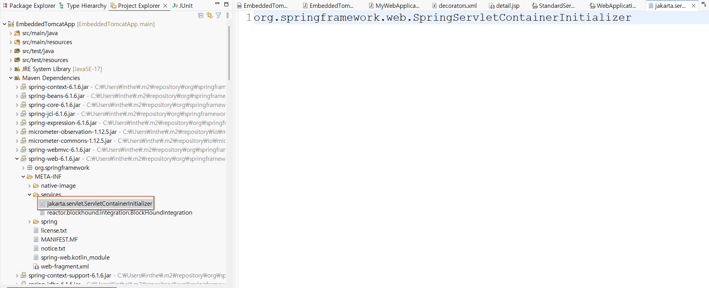
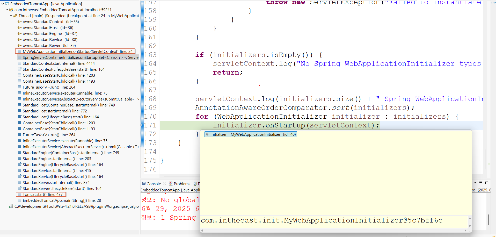

# ☕ ServletContainerInitializer SPI란?

**ServletContainerInitializer SPI**는 **서블릿 3.0 이상에서 도입된 확장 포인트**로,
서블릿 컨테이너(Tomcat, Jetty 등)가 애플리케이션을 시작할 때,
특정 클래스를 **자동으로 감지해서 초기화 작업을 수행할 수 있도록 하는 표준 메커니즘**입니다.

즉, `web.xml` 없이도 초기화 코드를 실행할 수 있게 해주는 \*\*Service Provider Interface(SPI)\*\*입니다.

---

## ✅ ServletContainerInitializer의 역할

```java
public interface ServletContainerInitializer {
    void onStartup(Set<Class<?>> c, ServletContext ctx) throws ServletException;
}
```

이 인터페이스를 구현하면 컨테이너가 애플리케이션 시작 시 `onStartup()`을 자동으로 호출해줍니다.

* `Set<Class<?>> c`: 관심 있는 클래스(예: 애노테이션이 붙은 클래스 등)의 집합
* `ServletContext ctx`: 서블릿 컨텍스트 객체. 이걸 통해 서블릿, 필터, 리스너 등을 등록할 수 있음

---

## 🔍 자동 등록 원리 — JAR SPI 메커니즘

이 SPI가 자동으로 동작하는 핵심은 `JAR 파일 내 META-INFO`에 있습니다.

### 📄 예: spring-web.jar 내부
<br>

```
META-INF/services/jakarta.servlet.ServletContainerInitializer
```

이 파일 내용:

```
org.springframework.web.SpringServletContainerInitializer
```

이 파일은 **이 JAR은 `ServletContainerInitializer`의 구현체를 가지고 있음**을 의미합니다.
즉, 컨테이너가 이 JAR을 읽고 해당 클래스를 실행합니다.

---

## 🧠 동작 흐름

```text
톰캣 시작
   ↓
classpath의 JAR들 중 META-INF/services/servletContainerInitializer 파일 읽음
   ↓
ServletContainerInitializer 구현체 인스턴스화
   ↓
@HandlesTypes 애노테이션으로 관심 있는 클래스들 수집
   ↓
onStartup(Set<Class<?>>, ServletContext) 호출
```
<br>

---

## 🧪 예제 ①: 직접 구현한 ServletContainerInitializer

```java
@HandlesTypes(MyMarkerInterface.class)
public class MyInitializer implements ServletContainerInitializer {
    @Override
    public void onStartup(Set<Class<?>> c, ServletContext ctx) {
        for (Class<?> clazz : c) {
            System.out.println("Detected class: " + clazz.getName());
        }
    }
}
```

그리고 `META-INF/services/jakarta.servlet.ServletContainerInitializer` 파일에 아래 한 줄 추가:

```
com.example.MyInitializer
```

이렇게 하면, 톰캣은 `MyInitializer`를 자동으로 실행하고
클래스패스에 있는 모든 `MyMarkerInterface` 구현체를 찾아 `onStartup()`으로 넘겨줍니다.

---

## 📌 Spring과의 관계: SpringServletContainerInitializer

Spring은 이 SPI를 구현한 **`SpringServletContainerInitializer`** 클래스를 제공합니다.

```java
public class SpringServletContainerInitializer implements ServletContainerInitializer {
    public void onStartup(Set<Class<?>> c, ServletContext ctx) {
        for (WebApplicationInitializer initializer : initializers) {
            initializer.onStartup(ctx);
        }
    }
}
```

즉, **Spring은 이 표준 SPI를 이용해 WebApplicationInitializer를 실행**합니다.

---

## 🧾 정리 요약

| 항목           | 내용                                                                            |
| ------------ | ----------------------------------------------------------------------------- |
| 정의           | 서블릿 컨테이너 시작 시 자동 초기화 코드를 실행할 수 있게 해주는 SPI                                     |
| 버전           | Servlet 3.0 이상                                                                |
| 핵심 인터페이스     | `ServletContainerInitializer`                                                 |
| 자동 등록 방식     | `META-INF/services/jakarta.servlet.ServletContainerInitializer` 파일에 구현 클래스 등록 |
| Spring 사용 방식 | `SpringServletContainerInitializer` → `WebApplicationInitializer` 감지 및 실행     |

---

## 📘 참고 링크

* [Jakarta EE 공식 문서 - Servlet 5.0](https://jakarta.ee/specifications/servlet/)
* [Spring WebApplicationInitializer Javadoc](https://docs.spring.io/spring-framework/docs/current/javadoc-api/org/springframework/web/WebApplicationInitializer.html)


